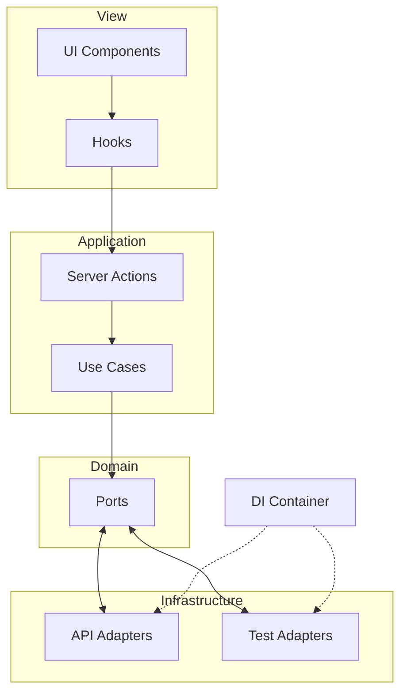

# File Picker

File picker with knowledge base indexing. Navigate folders, filter, sort, and index/de-index files and folders.

## Run locally

```bash
# Install dependencies
npm install

# Configure environment variables
cp .env.example .env.local
# Edit .env.local with your credentials (see Environment variables)

# Development mode
npm run dev
```

Open [http://localhost:3000](http://localhost:3000).

**Environment variables** (see `.env.example`):  
`NEXT_PUBLIC_STACK_AI_ANON_KEY`, `STACK_AI_EMAIL`, `STACK_AI_PASSWORD`, `STACK_AI_SUPABASE_AUTH_URL`, `STACK_AI_BACKEND_URL`.

## Scripts

| Script                  | Description                    |
| ----------------------- | ------------------------------ |
| `npm run dev`           | Development server             |
| `npm run build`         | Production build               |
| `npm run start`         | Production server              |
| `npm run test`          | Tests (watch)                  |
| `npm run test:run`      | Tests (single run)             |
| `npm run test:coverage` | Tests with coverage            |
| `npm run check`          | Lint + type-check + tests      |
| `npm run docs:generate`  | Generate Typedoc documentation |
| `npm run audit:ci`       | Run Lighthouse CI (builds, runs audit, uploads reports) |
| `npm run audit:lighthouse` | Instructions for manual Lighthouse via Chrome DevTools |

---

## Git hooks (Husky)

**Pre-commit** — runs lint and type-check; blocks commits if either fails.  
**Pre-push** — runs `npm run check` (lint + type-check + tests); blocks push until all pass.

Ensures code meets lint, types, and tests before it reaches the remote.

---

## Performance decisions

- **Lazy components** — `LazyFilePicker`, `LazySpeedInsights`, `LazyToaster` load via `next/dynamic` (`ssr: false`) to reduce initial bundle and improve LCP.
- **Server prefetch** — initial file list is fetched on the server and hydrated with `HydrationBoundary`; client skips first fetch.
- **Streaming** — page shell (h1, skeleton) streams first; `FilePickerWithPrefetch` suspends until prefetch completes, then sends data + client reference.
- **Font `display: swap`** — Geist fonts use `display: "swap"` so text paints immediately with fallback.
- **`optimizePackageImports`** — Next.js only bundles used modules from `lucide-react`, `radix-ui`.
- **Browserslist** — targets modern browsers (Chrome 111+, Safari 16.4+) to avoid legacy polyfills.

---

## Lighthouse

**Command:** `npm run audit:ci` — builds, audits [production URL](https://file-picker-smoky.vercel.app/), uploads reports.

**Results:** local → `.lighthouseci/*.html`; CI → **Actions → Artifacts → lighthouse-reports** (7 days); logs → temporary public URL.

**Target metrics** (`lighthouserc.js`)

| Metric | Target |
|--------|--------|
| Performance | ≥ 0.95 |
| Accessibility | = 1.0 |
| Best practices | = 1.0 |
| Cumulative Layout Shift (CLS) | ≤ 0.05 |

---

## CI (GitHub Actions)

[`.github/workflows/ci.yml`](.github/workflows/ci.yml) — triggers on push/PR to `master`.

| Job | Description |
|-----|-------------|
| Lint | ESLint |
| Type Check | `npm run type-check` |
| Test | Vitest (`npm run test:run`) |
| Lighthouse CI | Audit on push to `master` only; artifact `lighthouse-reports` (7 days). |

Node 20, `npm ci`.

---

## Development flows

1. **Implement features (including bonus)** — features and refinements.
2. **Implement integration tests** — before refactoring, to build confidence.
3. **Refactor** — improve maintainability, extensibility, and scalability while keeping tests green.

---

## Server Actions decisions

**Server Actions** replace API Routes. Benefits: type safety end-to-end, no CORS, automatic serialization, credentials on server (client never touches repos or APIs).

---

## TanStack Query caching

- **Per-folder cache**: content loaded once per folder (staleTime 1 min, gcTime 5 min).
- **Selective invalidation**: index/de-index mutations only invalidate Google Drive queries in `onSettled` to refresh `isIndexed`.

---

## UI/UX decisions

- **Optimistic UI** for index/de-index: immediate state update, rollback on error.
- **Prefetch on hover**: collapsed folder content preloads after 150ms hover.
- **Clear UX**: descriptive button labels, icons per file type, explicit "Indexed"/"Not indexed" states.
- **Skeleton loading** to avoid layout shift (CLS).

---

## Testing decisions

- **Unit tests**: use cases and utilities in `domain/use-cases/**/*.use-case.test.ts`; pass test implementations, no network.
- **Integration tests**: main flows (listing, filters, sorting, expand, index/de-index) via DI with `FileResourceRepositoryTestImpl`, `KnowledgeBaseRepositoryTestImpl`.

---

## Architecture

Hexagonal architecture with **SRP**, **Open/Closed**, and **dependency inversion**. The view does not depend on data access; ports can be implemented with REST, GraphQL, WebSocket, etc.

### Data flow

```
UI (components)
    │
    ▼
Custom Hooks (TanStack Query, orchestration)
    │
    ▼
Server Actions (thin wrappers)
    │
    ▼
Use Cases (pure business logic)
    │
    ▼
Ports (interfaces)
    ▲
    │
Adapters (implementations)
    └── DI Container ← injects API impl or Test impl
```

### Diagram



### Business logic isolation in use cases

Domain logic lives in `domain/use-cases/` as pure functions. Examples: `sortFilesUseCase` (A–Z, folders first), `applyFilesFiltersUseCase` (text, type, status), `validateIndexResourceUseCase`, `parseStatusUseCase` / `parseTypeUseCase` / `parseSortOrderUseCase`, `getDescendantResourceIdsUseCase`. UI and hooks only emit events and display data.

### Decoupling benefits

Ports can be swapped (REST, GraphQL, WebSocket, mock) without changing the view. New sources (Dropbox, OneDrive) require only new adapters. See [docs/DI_CONTAINER.md](docs/DI_CONTAINER.md).

---

## Project structure

| Folder            | Responsibility                              |
| ----------------- | ------------------------------------------- |
| `src/app/`        | App Router, layout, page                    |
| `src/actions/`    | Server Actions (wrappers that inject repos) |
| `src/components/` | UI (file-picker, file-table, filter-bar)    |
| `src/domain/`     | Types, ports, use cases                     |
| `src/hooks/`      | Server state logic (TanStack Query)         |
| `src/infra/`      | Adapters (API, test), mappers, DI Container |
| `src/test/`       | Test setup and utilities                    |

---

## Possible improvements

- **Multiple view modes** — list view, large icons (grid) beside the tree view.
- **Error Boundary** — fallback on render errors.
- **Sentry** — production error monitoring.
- **Persistent cache** — indexed IDs in localStorage to survive reloads.
- **E2E (Playwright)** — full flows (login → navigation → indexing).
- **Storybook**, **i18n**, **a11y** (axe-core, keyboard, screen readers).

---

## References

- [docs/DI_CONTAINER.md](docs/DI_CONTAINER.md) — DI Container and composition
- [docs/API_GUIDE.md](docs/API_GUIDE.md) — repository and API usage
