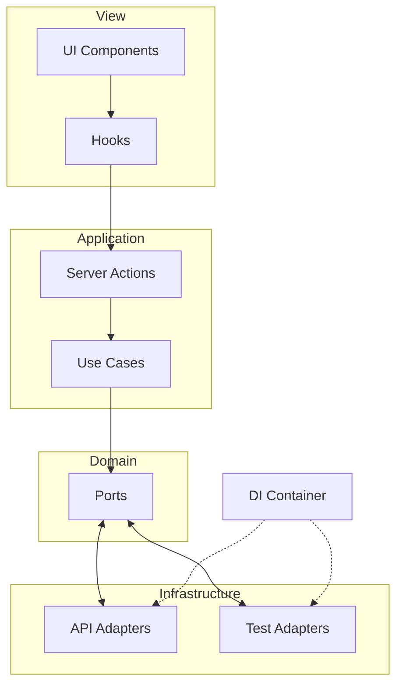

# File Picker

File picker with knowledge base indexing. Navigate folders, filter, sort, and index/de-index files and folders.

## Run locally

```bash
# Install dependencies
npm install

# Configure environment variables
cp .env.example .env.local
# Edit .env.local with your credentials (see Environment variables)

# Development mode
npm run dev
```

Open [http://localhost:3000](http://localhost:3000).

**Environment variables** (see `.env.example`):  
`NEXT_PUBLIC_STACK_AI_ANON_KEY`, `STACK_AI_EMAIL`, `STACK_AI_PASSWORD`, `STACK_AI_SUPABASE_AUTH_URL`, `STACK_AI_BACKEND_URL`.

## Scripts

| Script                  | Description                    |
| ----------------------- | ------------------------------ |
| `npm run dev`           | Development server             |
| `npm run build`         | Production build               |
| `npm run start`         | Production server              |
| `npm run test`          | Tests (watch)                  |
| `npm run test:run`      | Tests (single run)             |
| `npm run test:coverage` | Tests with coverage            |
| `npm run check`          | Lint + type-check + tests      |
| `npm run docs:generate`  | Generate Typedoc documentation |
| `npm run audit:ci`       | Run Lighthouse CI (builds, runs audit, uploads reports) |
| `npm run audit:lighthouse` | Instructions for manual Lighthouse via Chrome DevTools |

---

## Lighthouse

### Command

```bash
npm run audit:ci
```

This runs `lhci autorun --upload.target=temporary-public-storage`: it builds the app, starts a server, audits the production URL, asserts the metrics below, and uploads reports.

### Where to check results

- **Local run**: Reports are saved in `.lighthouseci/` (HTML and JSON per run). Open the `.html` files in a browser.
- **CI (GitHub Actions)**: On push to `master`, the Lighthouse job uploads the `.lighthouseci/` folder as an artifact. Download it from the workflow run: **Actions → select run → Artifacts → lighthouse-reports** (retention: 7 days).
- **Public report** (when using `temporary-public-storage`): LHCI outputs a URL in the logs where reports are hosted temporarily.

### Target metrics (assertions in `lighthouserc.js`)

| Metric | Target |
|--------|--------|
| Performance | ≥ 0.95 |
| Accessibility | = 1.0 |
| Best practices | = 1.0 |
| Cumulative Layout Shift (CLS) | ≤ 0.05 |

The audit runs against [https://file-picker-smoky.vercel.app/](https://file-picker-smoky.vercel.app/).

---

## CI (GitHub Actions)

Workflow: [`.github/workflows/ci.yml`](.github/workflows/ci.yml)

**Triggers**: Push and pull requests targeting `master`.

| Job | Description |
|-----|-------------|
| **Lint** | Runs ESLint |
| **Type Check** | Runs TypeScript check (`npm run type-check`) |
| **Test** | Runs Vitest (`npm run test:run`) |
| **Lighthouse CI** | Runs Lighthouse audit on production URL. **Only on push to `master`**, depends on Lint and Type Check. Uploads reports to temporary storage and as GitHub artifact (`lighthouse-reports`, 7 days). |

All jobs use Node 20, `npm ci`, and run in parallel (except Lighthouse, which waits for Lint and Type Check).

---

## Development flows

1. **Implement features (including bonus)** — features and refinements.
2. **Implement integration tests** — before refactoring, to build confidence.
3. **Refactor** — improve maintainability, extensibility, and scalability while keeping tests green.

---

## Server Actions decisions

**Server Actions** (Next.js) are used instead of API Routes as the layer between client and backend.

**Benefits:**

- **No API Routes** — avoids duplicating REST endpoints; actions are invoked directly from the client.
- **Type safety** — end-to-end typed arguments and return values between client and server.
- **No CORS** — actions run on the server, no cross-origin issues.
- **Automatic serialization** — Next.js serializes data between client and server.
- **Progressive enhancement** — works with JavaScript disabled (forms).
- **Security** — credentials and sensitive logic stay on the server; the client never accesses `getFileResourceRepository()` or the APIs.

---

## TanStack Query caching

- **Per-folder cache**: each folder/subfolder has its own query (`googleDrive`, `folderId`). Content is loaded **once**; TanStack Query keeps it cached (staleTime 1 min, gcTime 5 min) for instant navigation.
- **Selective invalidation**: mutations (index/de-index) only invalidate Google Drive queries in `onSettled`, reloading `isIndexed` state without unnecessary refetch of already-loaded content.
- **Prefetch on hover** complements the cache: hovering over a collapsed folder preloads its content in the background so it’s ready when expanded.

---

## UI/UX decisions

- **Optimistic UI** for indexing and de-indexing: state updates immediately; on error, rollback and show notification.
- **Prefetching on hover**: hovering over a collapsed folder preloads its content (150ms delay) to reduce latency when expanding.
- **Clear UX**: descriptive labels on buttons ("Index", "Remove", "Clear all filters"), icons per file type (PDF, CSV, TXT, etc.) and for folders, explicit "Indexed"/"Not indexed" states.
- **Skeleton during loading** to avoid layout shift (CLS) and improve perceived performance.

---

## Testing decisions

- **Unit tests**: utilities and business logic in use cases (`domain/use-cases/**/*.use-case.test.ts`). Run without network or DI, passing test implementations.
- **Integration tests**: main file picker flows (listing, filters, sorting, expand folders, index/de-index). Use DI with `FileResourceRepositoryTestImpl`, `KnowledgeBaseRepositoryTestImpl`, etc., to simulate responses without real API calls.

Integration tests demonstrate that test adapters (`infra/adapters/test/`) replace real adapters via `setRepositories()` without changing the view or hooks.

---

## Architecture

Hexagonal architecture with **SRP**, **Open/Closed**, and **dependency inversion**. The view does not depend on data access; ports can be implemented with REST, GraphQL, WebSocket, etc.

### Data flow

```
UI (components)
    │
    ▼
Custom Hooks (TanStack Query, orchestration)
    │
    ▼
Server Actions (thin wrappers)
    │
    ▼
Use Cases (pure business logic)
    │
    ▼
Ports (interfaces)
    ▲
    │
Adapters (implementations)
    └── DI Container ← injects API impl or Test impl
```

### Diagram



### Business logic isolation in use cases

All domain logic lives in `domain/use-cases/` as pure functions that take inputs and return outputs. Examples:

| Use case                                                          | Responsibility                                                                                                                            |
| ----------------------------------------------------------------- | ----------------------------------------------------------------------------------------------------------------------------------------- |
| `sortFilesUseCase`                                                | Sorts files A–Z/Z–A; folders always before files; uses `Intl.Collator` for locale-aware sorting.                                          |
| `applyFilesFiltersUseCase`                                        | Applies filters by search text, type (folder/file/pdf/csv/…), and status (indexed/not-indexed). Filtering logic centralized in one place. |
| `validateIndexResourceUseCase`                                    | Validates that a resource is indexable before indexing.                                                                                   |
| `parseStatusUseCase`, `parseTypeUseCase`, `parseSortOrderUseCase` | Parse URL query params into domain types (SortOrder, TypeFilter, StatusFilter).                                                           |
| `getDescendantResourceIdsUseCase`                                 | Fetches all descendant IDs of a folder for batch indexing.                                                                                |

The UI and hooks do not contain this logic: they only emit events and display data. Components can be replaced without touching the domain.

### Decoupling benefits

- Any port can be implemented with a different adapter (REST, GraphQL, WebSocket, mock) **without modifying the view or use cases**.
- Integration tests use `FileResourceRepositoryTestImpl`, `KnowledgeBaseRepositoryTestImpl`, etc.; the DI Container injects test implementations instead of real ones.
- New sources (Dropbox, OneDrive, etc.) can be added by defining adapters that fulfill the same ports.

See [docs/DI_CONTAINER.md](docs/DI_CONTAINER.md) for detailed documentation.

---

## Project structure

| Folder            | Responsibility                              |
| ----------------- | ------------------------------------------- |
| `src/app/`        | App Router, layout, page                    |
| `src/actions/`    | Server Actions (wrappers that inject repos) |
| `src/components/` | UI (file-picker, file-table, filter-bar)    |
| `src/domain/`     | Types, ports, use cases                     |
| `src/hooks/`      | Server state logic (TanStack Query)         |
| `src/infra/`      | Adapters (API, test), mappers, DI Container |
| `src/test/`       | Test setup and utilities                    |

---

## Possible improvements

- **Multiple view modes** — in addition to the current expandable tree view, add **list view** (compact table) and **large icons view** (grid with thumbnails/previews) for different usage flows.
- **Error Boundary** — catch render errors and show a fallback instead of a blank screen.
- **Sentry integration** — error monitoring in production.
- **Persistent cache** — persist indexed IDs in localStorage/sessionStorage to survive page reloads.
- **E2E with Playwright** — cover full flows (login → navigation → indexing).
- **Storybook** — visual documentation for reusable components.
- **Internationalization (i18n)** — translatable labels and messages.
- **Accessibility (a11y)** — audits with axe-core, keyboard and screen reader support.

---

## References

- [docs/DI_CONTAINER.md](docs/DI_CONTAINER.md) — DI Container and composition
- [docs/API_GUIDE.md](docs/API_GUIDE.md) — repository and API usage
